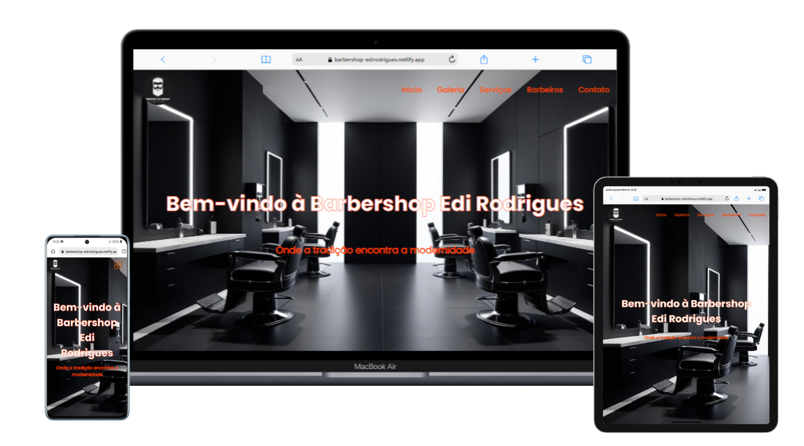

<h1> Barbershop Edi Rodrigues</h1>
<h2> Projeto pessoal-barbearia</h2>

## Table of contents
- [Overview](#overview)
- [Description](#description)
- [Screenshot](#screenshot)
- [My process](#my-process)
- [Site Link](#site-link)
- [Author](#author)

## Description
Desde que comecei meus estudos no curso DevClub, tive a oportunidade de mergulhar de cabeça no mundo do desenvolvimento web. Esse sendo meu primeiro projeto, que me empolgou e me ensinou foi a criação do site Barbershop Edi Rodrigues e os exercicios durante esses dois meses de curso. Foi uma experiência incrível ver minhas habilidades em HTML, CSS e JavaScript se unindo para dar vida a um site real.

Eu me dediquei a cada detalhe, desde a estruturação do conteúdo com HTML, passando pela estilização e responsividade impecável com CSS, até a implementação de funcionalidades interativas com JavaScript. Cada linha de código foi um aprendizado, e cada desafio superado me deu mais confiança.

O Barbershop Edi Rodrigues não é apenas um site; é a materialização do meu esforço e do conhecimento que adquiri no DevClub. Ele representa um passo importante na minha jornada como desenvolvedor, e estou muito orgulhoso do resultado final. Mal posso esperar para aplicar o que aprendi em futuros projetos!

## Screenhot

## My process
- HTML
- CSS
- JAVASCRIPT

<h2>1. Planejamento e Estruturação (HTML)</h2>
Comecei pelo HTML, que é o esqueleto do site. Dediquei tempo para pensar na estrutura do conteúdo: onde ficaria o cabeçalho, as seções de serviços, a galeria de fotos e o rodapé.

<h2>2. Estilização e Responsividade (CSS)</h2>
Com a estrutura HTML definida, mergulhei no CSS. Esta foi a etapa em que o Barbershop Edi Rodrigues ganhou sua identidade visual. Desde a escolha de cores que remetessem ao ambiente de uma barbearia até a definição de fontes e espaçamentos, cada detalhe foi pensado para criar uma experiência agradável ao usuário.

Um dos maiores desafios e focos aqui foi a responsividade. Garantir que o site ficasse impecável em diferentes tamanhos de tela – de celulares a desktops.

<h2>3. Interatividade e Dinamismo (JavaScript)</h2>
Por fim, integrei o JavaScript para trazer vida e interatividade ao projeto. Embora o Barbershop Edi Rodrigues seja um site mais focado em apresentação, o JavaScript foi utilizado para adicionar funcionalidades que melhoram a experiência do usuário. Por exemplo, a criação de menus responsivos que abrem e fecham com um clique, validação de formulários de contato ou até mesmo pequenas animações que tornam a navegação mais fluida e envolvente.
Cada script adicionado foi uma oportunidade de aprofundar meu conhecimento na lógica de programação e na manipulação do DOM.

## Site Link
- https://barbershop-testsite.netlify.app/

## Author
- Front-end developer: "Vander Luís".
